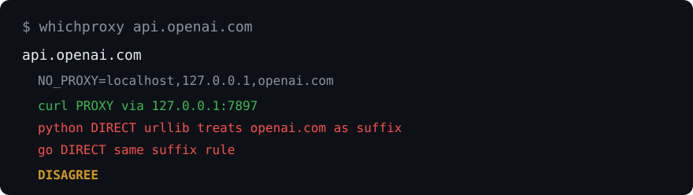

# whichproxy

浏览器走了 Clash，Codex / Claude 还是 `403 country not supported`。

十有八九是 `NO_PROXY` 里写了 `openai.com`。curl 仍走代理，Python 和 Go **直连**。`whichproxy` 把这种不一致打出来。它自己不发任何请求。

[English](README.md) · [简体中文](README.zh-CN.md)



## 警告

> [!WARNING]
> **不要**把 `openai.com`、`.openai.com`、`api.openai.com`、`auth.openai.com`、`chatgpt.com`、`.chatgpt.com` 写进 `NO_PROXY`。
>
> 这会让 Codex / ChatGPT 换 token 绕过 Clash。
>
> `NO_PROXY` 只留本机地址，例如：
>
> ```text
> localhost,127.0.0.1,::1
> ```

## 安装

Python 3.10+，零依赖。尚未上 PyPI：

```bash
pip install git+https://github.com/hc-ui/whichproxy.git
```

装好后在当前终端跑 `whichproxy doctor`。

## 20 秒上手

错误的 `NO_PROXY`（Windows + Clash 上最常见的坑）：

```powershell
$env:HTTP_PROXY  = "http://127.0.0.1:7897"
$env:HTTPS_PROXY = "http://127.0.0.1:7897"
$env:NO_PROXY    = "localhost,127.0.0.1,openai.com"
whichproxy api.openai.com
```

POSIX：

```bash
HTTP_PROXY=http://127.0.0.1:7897 \
HTTPS_PROXY=http://127.0.0.1:7897 \
NO_PROXY=localhost,127.0.0.1,openai.com \
whichproxy api.openai.com
```

```text
api.openai.com
  HTTP_PROXY=http://127.0.0.1:7897
  NO_PROXY=localhost,127.0.0.1,openai.com
  curl    PROXY   (via http://127.0.0.1:7897)
  python  DIRECT  (urllib proxy_bypass)
  go      DIRECT  (suffix openai.com)
```

curl 对无前导点的 token 只做精确匹配；Python 和 Go 把 `openai.com` 当后缀。该主机会标成 `DISAGREE`。

## 命令

| 命令 | 作用 |
| --- | --- |
| `whichproxy HOST [HOST...]` | 按 curl / python / go 打印每个主机的路由 |
| `whichproxy env` | 打印与代理相关的环境变量 |
| `whichproxy doctor` | 检查常见 AI 主机，并对危险的 `NO_PROXY` 项告警 |
| `whichproxy suggest` | 打印一份安全的 `NO_PROXY`（不改环境变量） |
| `whichproxy --json` | 同样的结果，机器可读输出 |

`env` / `doctor` 会读取 `HTTP_PROXY`、`HTTPS_PROXY`、`ALL_PROXY`、`NO_PROXY`（以及小写别名）。

## 三种匹配器

同一份 `NO_PROXY`，三种模型。核心差别就是有没有前导点：

| 模型 | 匹配规则 | `openai.com`（无点） | `.openai.com`（前导点） |
| --- | --- | --- | --- |
| **curl** | `*` = 全部；无点 = **精确**匹配；前导 `.` = **仅子域** | 只匹配 `openai.com`，**不**匹配 `api.openai.com` | 匹配 `api.openai.com`，**不**匹配 `openai.com` 本身 |
| **python** | `urllib.request.proxy_bypass_environment` — **后缀**匹配 | `openai.com` **和** `api.openai.com` | 遵循 urllib（去掉前导 `.` 后再做后缀匹配） |
| **go** | `*` = 全部；无点 = 该主机**及其子域**；前导 `.` = **仅子域**；IP 支持 CIDR | `openai.com` **和** `api.openai.com` | 匹配 `api.openai.com`，**不**匹配 `openai.com` 本身 |

不一致时标为 `DISAGREE`，并给出每个模型的原因。

## 隐私

- **仅本地。** 只读环境变量。不发网络请求，不要 API key，不上传任何内容。
- 代理 URL 里若有 `user:password`，输出中会打码密码。

## 许可证

[MIT](LICENSE)
